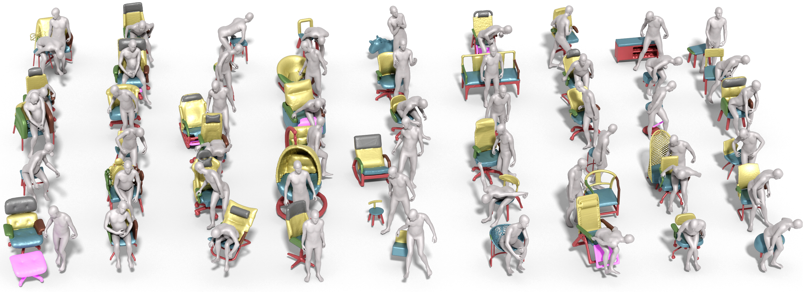

# *CHAIRS*: Towards Full-Body Articulated Human-Object Interaction
<p align="left">
    <a href='https://arxiv.org/abs/2212.10621'>
      
    </a>
    <a href='https://arxiv.org/pdf/2212.10621.pdf'>
      
    </a>
    <a href='https://jnnan.github.io/project/chairs'>
      
    </a>
     <a href='https://drive.google.com/file/d/1Buh80YimVzKsdEn9gk00CSGEUsKmkAJT/view'>
      
    </a>
</p>

<p align="center"></p></br>

This is the code repository of **CHAIRS: Towards Full-Body Articulated Human-Object Interaction**

[arXiv](https://arxiv.org/abs/2212.10621) | [PDF](https://arxiv.org/pdf/2212.10621.pdf) | [Project Page](https://jnnan.github.io/project/chairs) | [Data](https://drive.google.com/file/d/1Buh80YimVzKsdEn9gk00CSGEUsKmkAJT/view)

# Environment
We tested our code with CUDA 11.1, PyTorch 1.11.0, and torchvision 0.10.0. 

After installing CUDA, PyTorch and torchvision, run the following command for installing other dependencies:
```shell
pip install -r requirements.txt
```

# Data Preparation
### CHAIRS dataset
* Register and download the SMPL-X models from [here](https://smpl-x.is.tue.mpg.de/download.php) and unzip them to `data/body_models/smplx/`. 
* Download our data and checkpoints from [google drive](https://drive.google.com/file/d/1Buh80YimVzKsdEn9gk00CSGEUsKmkAJT/view?usp=sharing) or [baidu netdisk]() and unzip them to `data/`.

You should have the following file structure now: 

```
├─ data
    ├─ AHOI_ROOT
        ├─ OBJECT_META
        ├─ OBJECT_VOXEL
    ├─ DATA_FOLDER
        ├─ IMG_ROOT
            ├─ 0001
                ├─ 1
                    ├─ 0000.png
                    ├─ 0005.png
                    ├─ 0010.png
                    ...
                ├─ 2
                ├─ 3
                ├─ 4
            ├─ 0002
            ...
    ├─ body_models
        ├─ smplx
├─ checkpoints
```
The checkpoint folder contains pretraine models for reconstruction and HOI prior respectively.


# Code

## Reconstruction
### Reconstruction Model Training
Run the following commands for training:
```shell
python train_voxel_pred.py --config ./configs/train_voxel_pred.yaml
```
After the training is finished, the weight file will be stored in `./checkpoints/exp_name/model_voxel_pred.pth`.
### Reconstruction Model Testing
Run the following commands to extract mesh result:
```shell
python test_voxel_pred.py --config ./configs/test_voxel_pred.yaml
```
We provide weight file in [model_voxel_pred.pth](https://drive.google.com/file/d/1Buh80YimVzKsdEn9gk00CSGEUsKmkAJT/view?usp=sharing). You can download it for testing on CHAIRS data.

### HOI Prior Model Training
The HOI Prior is the model for optimizing the part-level 6D pose of the articulated object under kinematics constraints. Run the following commands for training HOI prior:
```shell
python train_contrast_cvae.py --config ./configs/train_cvae.yaml
```
After the training is finished, the weight file will be stored in ./checkpoints/exp_name/cvae.pth.

## HOI Prior

### Reconstruction Model Testing
Run the following commands to extract mesh result:
```shell
python test_voxel_pred.py --config ./configs/test_voxel_pred.yaml
```
We provide weight file in [cvae.pth](https://drive.google.com/file/d/1Buh80YimVzKsdEn9gk00CSGEUsKmkAJT/view?usp=sharing). You can download it for testing on CHAIRS data.

## Optimization

The Optimization module utilizes training checkpoints of HOI prior. You can turn off the reconstruction model and skip the corresponding loss term. You may specify the path of models and data paths in `./configs/optim.yaml`.

Run the following commands for evaluation:
```shell
python optimize_cvae_part.py --config ./configs/optim.yaml
```

Here we clarify the parameters in config files.

- `save_image`: Whether or not to save visualization of optimization process in gif.
- `n_step`: the number of step in optimization.
- `output_dir`: The save path of visualization outcomes.
- `n_grid`: The resolution of voxelized object and human. The only resolution we support now is 64 (default value).
- `lr`: the speed of gradient descent in optimization.
- `prior_hidden`: the length of the hidden vector in HOI prior model.
- `recon_hidden`: the length of the hidden vector in reconstruction model.
- `prior_model`: path of checkpoint of HOI prior model.
- `recon_model`: path of checkpoint of reconstruction model
- `dataset_dir`: path of testing dataset.

# Citation
If you find our work useful, please cite
```BibTeX
@article{jiang2022chairs,
  title={CHAIRS: Towards Full-Body Articulated Human-Object Interaction},
  author={Nan Jiang, Tengyu Liu, Zhexuan Cao, Jieming Cui, Yixin Chen, He Wang, Yixin Zhu, Siyuan Huang},
  journal={arXiv preprint arXiv:2212.10621},
  year={2022}
}
```


